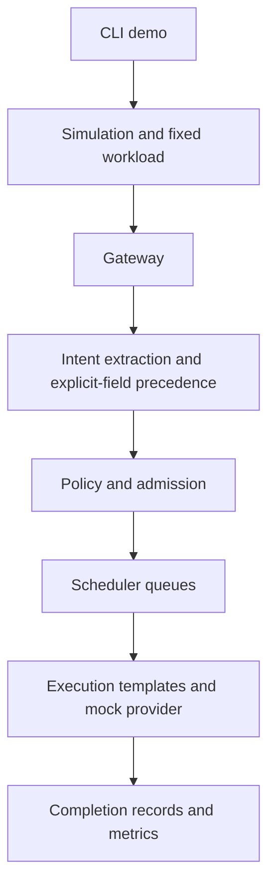

# Architecture and experiment assumptions

The CLI is registered in [pyproject.toml](../pyproject.toml) and implemented in [cli.py](../src/intent_scheduler/cli.py). [simulation.py](../src/intent_scheduler/simulation.py) runs the three configurations sequentially with separate gateways and simulated clocks. They receive the same [workload](../src/intent_scheduler/workload.py).

The experiment supplies explicit contracts. The extraction path still calls the mock provider, but explicit fields take precedence. It does not measure natural-language extraction accuracy. Policy chooses model, effort, template, priority, eligibility time, and an estimated cost. Admission rejects work whose estimated execution cost exceeds the cap.

Static uses uniform Terra medium-effort self-checking with immediate FIFO. Contract-FIFO selects execution from each contract and retains immediate FIFO. Intent-aware uses the same execution choices and adds priority classes, earliest-deadline-first ordering within a class, deferral, and deadline escalation. The experiment uses three call-capacity slots with zero class reservations. Three parallel drafts reserve three slots; sequential self-checking reserves one.

The 72 tasks arrive in eight fixed bursts between 09:00 and 16:50 UTC. Service duration depends on configured model and effort, rounded by ten-minute simulation ticks. Parallel drafts form one concurrent stage; candidate selection adds time. Extraction and post-completion quality judging contribute accounting overhead but not simulated service duration. Peak slot demand is held for the whole task interval.

Patient work can be deferred to 02:00 the next day if the deadline leaves enough margin. Deferred work is restricted by a load threshold and can be promoted as its deadline approaches. Idle capacity during deliberate deferral is expected. No randomness or real-provider latency is modeled.

Model identifiers and prices are configured experiment assumptions, not statements about current commercial availability. Modeled execution cost uses estimated token counts; it differs from mock-provider accounting. See [results](results.md).
