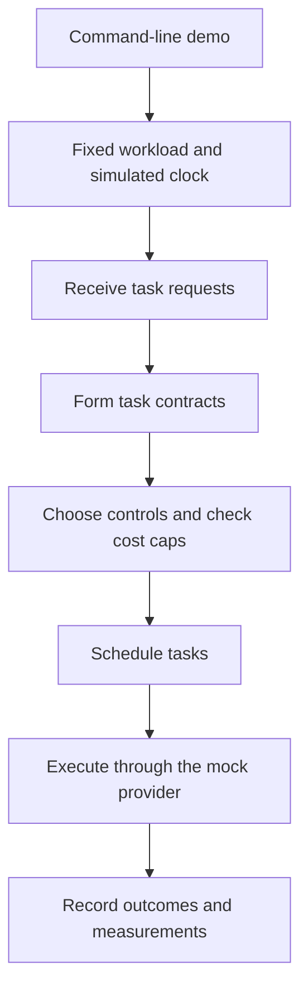

# Architecture and Experiment Assumptions

The gateway receives requests, selects execution settings, and schedules tasks. The experiment runs each configuration separately with its own gateway and simulated clock, using the same fixed workload.

[cli.py](../src/intent_scheduler/cli.py), registered in [pyproject.toml](../pyproject.toml), starts [simulation.py](../src/intent_scheduler/simulation.py). The simulation runs the three configurations sequentially on the tasks in [workload.py](../src/intent_scheduler/workload.py).

## From Request to Execution

A task contract records requirements for quality, completion time, cost, and attention. The gateway can extract them from request text, with explicitly supplied fields taking precedence. The experiment supplies all contract fields explicitly.

The policy selects a model, reasoning effort, and execution template. A template specifies how calls are combined, such as generating one response, checking it in a second call, or generating parallel drafts and selecting one. The policy also assigns a priority class and earliest start time. Admission checks reject tasks whose estimated execution cost exceeds their cap.

## The Three Configurations

The static reference uses Terra with medium reasoning effort and a self-check for every task. Tasks become eligible on arrival and are served in first-in, first-out (FIFO) order. Contract-FIFO selects execution settings from each contract while retaining this scheduling behavior.

Intent-aware scheduling uses the same execution choices as contract-FIFO in this experiment. It schedules by priority class and serves earlier deadlines first within each class. It can defer patient tasks to a period of lower load and raise their priority as deadlines approach.

## Capacity and Timing

The 72 tasks arrive in eight fixed bursts between 09:00 and 16:50 UTC. The gateway has three provider-call slots, with none reserved for individual priority classes. Three parallel drafts reserve all three slots, while a response followed by a self-check uses one because the calls are sequential. Each task retains its peak slot requirement until completion.

Service duration depends on the model and reasoning effort. The execution template determines how call durations combine. Parallel drafts occupy one concurrent stage, followed by candidate selection. Completion is recorded at the first ten-minute clock tick when the assumed duration has elapsed. Extraction and final quality judging contribute to mock accounting but not simulated duration.

Patient tasks can be deferred to 02:00 the following day if enough deadline margin remains. Dispatch then depends on the load threshold and available capacity. Deadline-based promotion can make tasks eligible earlier. Capacity may remain idle while the gateway waits for the planned low-load window.

## Modeling Assumptions

The experiment includes no random variation or measured real-provider latency. Model identifiers and prices are fixed assumptions rather than claims about current commercial availability. It does not measure extraction accuracy.

Reported execution costs use estimated token counts and configured prices. Mock accounting instead records the calls made during execution. The [results guide](results.md) explains these measurements.
